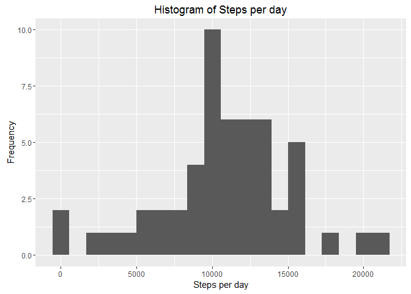
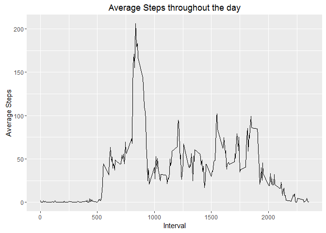
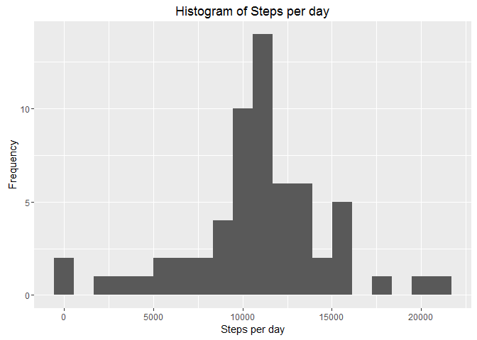

# Reproducible Research: Peer Assessment 1

#Activity Monitoring

This assignment makes use of data from a personal activity monitoring device.
This device collects data at 5 minute intervals through out the day. 
The data consists of two months of data from an anonymous individual collected 
during the months of October and November, 2012 and include the number of 
steps taken in 5 minute intervals each day.

## Loading and preprocessing the data

Load libraries

```r
library(dplyr)
```

```
## 
## Attaching package: 'dplyr'
```

```
## The following objects are masked from 'package:stats':
## 
##     filter, lag
```

```
## The following objects are masked from 'package:base':
## 
##     intersect, setdiff, setequal, union
```

```r
library(ggplot2)
library(lattice)
```


```r
rm(list=ls())
data <- read.csv('activity.csv')
```

Get a feel for the data.

```r
head(data)
```

```
##   steps       date interval
## 1    NA 2012-10-01        0
## 2    NA 2012-10-01        5
## 3    NA 2012-10-01       10
## 4    NA 2012-10-01       15
## 5    NA 2012-10-01       20
## 6    NA 2012-10-01       25
```

```r
summary(data)
```

```
##      steps                date          interval     
##  Min.   :  0.00   2012-10-01:  288   Min.   :   0.0  
##  1st Qu.:  0.00   2012-10-02:  288   1st Qu.: 588.8  
##  Median :  0.00   2012-10-03:  288   Median :1177.5  
##  Mean   : 37.38   2012-10-04:  288   Mean   :1177.5  
##  3rd Qu.: 12.00   2012-10-05:  288   3rd Qu.:1766.2  
##  Max.   :806.00   2012-10-06:  288   Max.   :2355.0  
##  NA's   :2304     (Other)   :15840
```

```r
str(data)
```

```
## 'data.frame':	17568 obs. of  3 variables:
##  $ steps   : int  NA NA NA NA NA NA NA NA NA NA ...
##  $ date    : Factor w/ 61 levels "2012-10-01","2012-10-02",..: 1 1 1 1 1 1 1 1 1 1 ...
##  $ interval: int  0 5 10 15 20 25 30 35 40 45 ...
```
Format dates.

```r
data$date <- as.Date(data$date)
```


## What is mean total number of steps taken per day?

Calculate the total number of steps taken per day  

Remove missing values

```r
complete_data <- data[complete.cases(data),]
```

Group up data by day

```r
data_by_day <- complete_data %>%
        group_by(date) %>%
        summarise(steps_per_day = sum(steps))
```

Make a histogram of the total number of steps taken each day


```r
ggplot(data_by_day, aes(steps_per_day)) + geom_histogram(bins = 20) + 
        labs(title = "Histogram of Steps per day", 
             x = "Steps per day", 
             y = "Frequency")
```

<!-- -->

Calculate the mean and median of the total number of steps taken per day  
Mean

```r
mean(data_by_day$steps_per_day)
```

```
## [1] 10766.19
```

Median

```r
median(data_by_day$steps_per_day)
```

```
## [1] 10765
```
## What is the average daily activity pattern?

Make a time series plot of the 5-minute interval (x-axis) and the average 
number of steps taken, averaged across all days (y-axis)  

Aggregate data.

```r
aggregate <- complete_data %>%
                group_by(interval) %>%
                summarise(average_steps_per_interval = mean(steps))

ggplot(aggregate, aes(x = interval, y = average_steps_per_interval)) + 
        geom_line() +
        labs(title = "Average Steps throughout the day", 
             x = "Interval", 
             y = "Average Steps")
```

<!-- -->

Which 5-minute interval, on average across all the days in the dataset, 
contains the maximum number of steps?


```r
aggregate[which.max(aggregate$average_steps_per_interval),]
```

```
## Source: local data frame [1 x 2]
## 
##   interval average_steps_per_interval
##      (int)                      (dbl)
## 1      835                   206.1698
```

## Imputing missing values

Calculate and report the total number of missing values in the dataset.


```r
sum(is.na(data))
```

```
## [1] 2304
```

Filling in all of the missing values in the dataset, use agerage of each 
5 minute interval.

First join to the average per interval


```r
data_merge <- merge(data, aggregate, by = "interval")
data_merge[is.na(data_merge$steps),]$steps <-           
        data_merge[is.na(data_merge$steps),]$average_steps_per_interval
data_merge$average_steps_per_interval <- NULL
```

Check if any are still missing.

```r
sum(is.na(data_merge))
```

```
## [1] 0
```
Nothing missing anymore.


Make a histogram of the total number of steps taken each day and Calculate and 
report the mean and median total number of steps taken per day.

Group up data by day

```r
data_by_day2 <- data_merge %>%
        group_by(date) %>%
        summarise(steps_per_day = sum(steps))
```

Make a histogram of the total number of steps taken each day


```r
ggplot(data_by_day2, aes(steps_per_day)) + geom_histogram(bins = 20) + 
        labs(title = "Histogram of Steps per day", 
             x = "Steps per day", 
             y = "Frequency")
```

<!-- -->

Calculate and report the mean and median total number of steps taken per day. 
Mean

```r
mean(data_by_day2$steps_per_day)
```

```
## [1] 10766.19
```

Median

```r
median(data_by_day2$steps_per_day)
```

```
## [1] 10766.19
```

The mean/median have hardly changed at all compared to the original estimates.

## Are there differences in activity patterns between weekdays and weekends?

Create a new factor variable with two levels- "weekday" & "weekend".

```r
data_merge$day_of_week <- as.factor(weekdays(data_merge$date))
data_merge$day_of_week <- factor(data_merge$day_of_week, levels= 
                                     c("Monday", "Tuesday",
                                       "Wednesday", "Thursday"
                                       , "Friday", "Saturday", "Sunday"))

data_merge$weekday_or_weekend <- "Weekday"
data_merge$weekday_or_weekend[data_merge$day_of_week == "Saturday"]  <- "Weekend"
data_merge$weekday_or_weekend[data_merge$day_of_week == "Sunday"]  <- "Weekend"

data_merge$weekday_or_weekend = as.factor(data_merge$weekday_or_weekend)
```

Make a panel plot containing a time series plot of the 5-minute 
interval (x-axis) and the average number of steps taken, averaged across all 
weekday days or weekend days (y-axis)


Group up data

```r
weekday_aggregate <- data_merge %>%
                group_by(interval, weekday_or_weekend) %>%
                summarise(steps = mean(steps))
    
xyplot(steps ~ interval | weekday_or_weekend, 
        weekday_aggregate, type = "l", layout = c(1, 2))
```

<!-- -->


